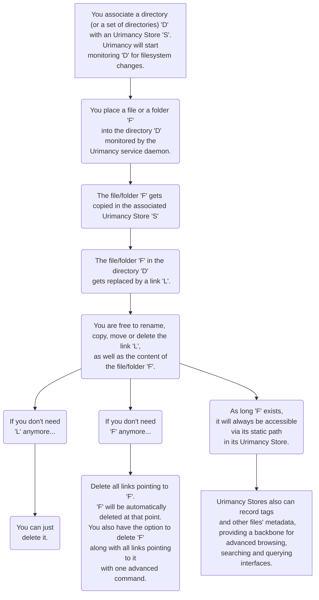

# Urimancy

URI Stores for unbreakable references.

## Motivation
Naming things is famously "one of the hard problems" in computer science.
Even harder, it is to quickly come up with a whole hierarchical tree of file paths that cannot ever be changed later on the way,
unless dealing with a whole lot of broken references.  
At the same time, people traditionally try to use filesystem trees to semantically organize and browse files,
yet trees are not much suitable for that purpose (compared to databases). There are filesystem links, but they are tedious and suboptimal (again, compared to databases). 

The idea is then to stop trying to come up with more and more sophisticated hierarchies to organize files.   
One simple hierarchy shall suffice for all storing purposes,
while databases can take care of the retrieval part (searching, browsing or querying, or a combination of the three). 

## Core concept

- You associate a directory (or a set of directories) 'D' with an Urimancy Store 'S'. Urimancy will start monitoring 'D' for filesystem changes.
- You place a file or a folder 'F' into the directory 'D' monitored by the Urimancy service daemon.
- The file/folder 'F' dets copied in the associated Urimancy Store 'S'.
- The file/folder 'F' in the directory 'D' gets replaced by a link 'L'.
- You are free to rename, copy, move or delete the link 'L', as well as the content of the file/folder 'F'.
- If you don't need 'L' anymore...
  - you can just delete it.
- If you don't need 'F' anymore...
  - Delete all links pointing to 'F'. 'F' will be automatically deleted at that point. You also have the option to delete 'F' along with all links pointing to it with one advanced command.
- As long 'F' exists, it will always be accessible via its static path in its Urimancy Store.
  - Urimancy Stores also can record tags and other files' metadata providing a backbone for advanced browsing, searching and querying interfaces.

